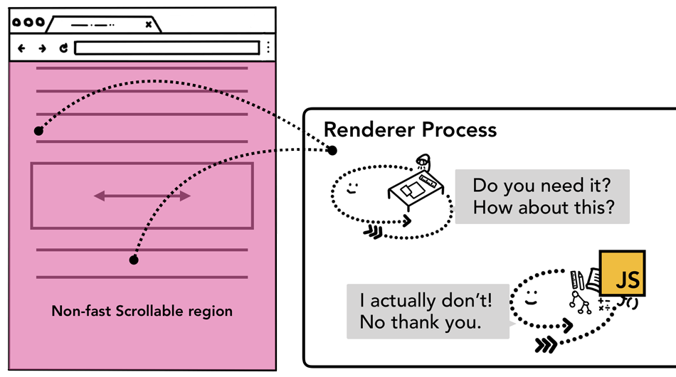
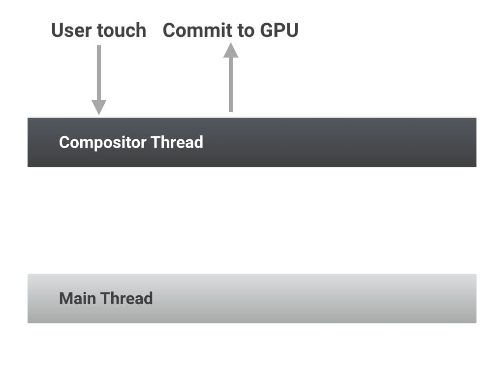

import { Aside } from '@astrojs/starlight/components';

## 들어가며

스크롤 이벤트를 다루는 기술을 떠올려보면 크게 세가지가 떠오른다.


이러한 스크롤 이벤트를 다루는 페이지들에서는 fps drop을 중요시 여긴다. 많은 디바이스는 60fps로 작동하는 것을 인지해야 한다. 그리고 한 프레임이 `1000 / 60 ms`, 16ms 안에 렌더링을 완료 해야한다. 그렇지 않으면 서비스 이탈로 이어질 가능성이 높아진다.

> 한 화면이 16ms 안에 렌더링 되어야 하고, 총 10ms 내에 JavaScript 실행을 마쳐야 한다.
>
> [web.dev - 렌더링 퍼포먼스](https://web.dev/rendering-performance/)

그렇다면 `스크롤 이벤트 최적화`가 필요할텐데, 어떻게 스크롤 이벤트 최적화를 해야할까?

## Throttling with `requestAnimationFrame`...?

> Throttling 개념을 모른다면 [CSS-Tricks - debounce와 throttle](https://css-tricks.com/debouncing-throttling-explained-examples/) 을 참고하세요!

```html:title=throttle.html {10}
<!DOCTYPE html>
<html>
<head>
</head>
<body style="height: 500vh;">
    <script>
        let ticking = false;
        function onScroll() {
        	if (!ticking) {
                requestAnimationFrame(() => {
                    console.log("tick") // Changing some DOM.
                    ticking = false;
                })
            }
            ticking = true;
        }
        window.addEventListener('scroll', onScroll);
    </script>
</body>
</html>
```
리페인트 전에 호출되는 `requestAnimationFrame`을 이용해 frame이 생성되는 delay 이내에 들어온 이벤트들을 무시한다는 이론과 함께 만들어진 패턴이다. 밑의 그림을 보면 정말 throttling이 제대로 작동하는 것처럼 보인다.


하지만 위의 경우와 반대로 Throttling이 있을 때 더 로깅되는 때도 있다.

...? 뭔가 이상하다. 몇 번 Throttle되었는지 확인해보자.

```html:title=throttle-2.html {15}
<!DOCTYPE html>
<html>
<head>
</head>
<body style="height: 500vh;">
    <script>
        let ticking = false;
        function onScroll() {
        	if (!ticking) {
                requestAnimationFrame(() => {
                    console.log("tick") // Changing some DOM.
                    ticking = false;
                })
            } else {
                console.log("Throttled") // log when Throttled
            }
            ticking = true;
        }
        window.addEventListener('scroll', onScroll);
    </script>
</body>
</html>
```

위 코드는 몇 번 Throttle되었는지 확인하는 코드이다. 과연 이 코드에서는 몇번의 Throttled를 로깅할까?


정답은 0번이다. 왜 Throttling이 적용되지 않을까? 우리는 이를 알기 위해 브라우저 렌더링이 어떻게 흘러가는지 알아보아야 한다.

## 브라우저 렌더링 원리

브라우저 렌더링 원리를 찾아보면 많이 나오는 그림은 다음과 같다.

[](https://www.html5rocks.com/en/tutorials/internals/howbrowserswork/)

유명한 그림이지만 2011년에 나온 그림이다. 꽤 오래된 그림이므로 새로운 그림으로 바꿔보았다.

[](https://web.dev/rendering-performance/)

### JavaScript

처음 렌더링 시 HTML 파싱 및 DOM 트리 구성, JavaScript Engine(ex.V8, SpiderMonkey...)의 JS 실행이 여기 포함된다. event handler에 의해 실행되는 JavaScript도 여기에 포함된다.

### Style(Recalculate Style)

CSS 파싱 후 CSSOM 생성과 함께 한 요소의 Computed Style을 생성한다. 그 뒤에는 DOM Tree와 합쳐서 Render Tree를 만든다. 아래 그림은 웹 개발자 도구에서 볼 수 있는 Computed Style이다.


### Layout(Reflow)

이제 Render Tree를 순회하면서 해당 노드의 위치와 크기를 측정하여 Layout Tree를 만든다. 웹 페이지에 보이는 요소로만 만드므로 `display: none`이 담긴 요소는 Layout Tree에 포함되지 않고, `::before`같은 pesudo class의 콘텐츠는 Layout Tree에 포함된다.

### Update Layer

Layout Tree에서 일정한 기준(ex. transform 속성 등)에 따라 Layer를 생성하고, Layer Tree를 만든다.

### Paint

Layer Tree를 바탕으로 Layer의 모든 시각적 요소를 그리는 순서(Paint Record)를 제작한다. 아래 그림은 BCSD Lab에서 만든 코인 어플리케이션의 Layer를 보여준다.


### Composite

Compositor 스레드에서 레이어를 타일로 나눈 뒤, 나눈 타일을 Raster 스레드로 넘긴다. 그 이후 타일을 픽셀화 해서 GPU에 저장한다. 이후 타일을 합쳐서 프레임을 만들고 GPU에 렌더링 요청을 한다.


> 더 자세한 렌더링 과정은 다음을 참고하세요!
> 
> [DEVIEW 2018 - 웹 성능 최적화에 필요한 브라우저의 모든 것](https://deview.kr/2018/schedule/252)
> 
> [Naver D2 - 렌더러 프로세스의 내부 동작](https://d2.naver.com/helloworld/5237120)

위와 같은 과정을 [Vsync 신호가 나올 때마다 반복](https://deview.kr/2015/schedule#session/87)한다. 이 때 `requestAnimationFrame`의 콜백은 어디서 호출되는가를 알아보자면 `Style(Recalculating Style)`을 하기 전에 실행된다.


## Event loop와 requestAnimationFrame

`requestAnimationFrame`에 보낸 callback이 어디에서 저장되는지 살펴보면 아래와 같다.


<Aside type="note">
2024.12.14 추가:
<br />
정확하게는 `requestAnimationFrame`를 위한 queue는 HTML 스펙에 적혀있지 않다. 쉬운 이해를 위해 Queue라고 표현했으며, 표준에서 콜백은 `Map` 형태에 저장된다는 것을 밝힌다.
<br />
정확한 구현을 이해하기 위해서는 [Stackoverflow 답변](https://stackoverflow.com/a/77012586)과 [Jake Archibald의 In the loop 발표](https://www.youtube.com/watch?v=cCOL7MC4Pl0)를 추천한다.
</Aside>


Timer나 event handler를 저장하는 (Macro)Task Queue, Promise handler와 MutationObserver callback를 저장하는 MicroTask Queue, 그리고 requestAnimationFrame의 callback을 저장하는 AnimationFrame이 있다. 즉 Style을 계산하기 전에 해당 프레임에 AnimationFrame에 저장된 callback들을 모두 실행한다. 새로고침 아이콘이 의미하는 Event loop가 어떻게 Queue에 있는 Task들을 Call stack에 두는지 자세하게 보면 다음과 같다.


(이해를 바탕으로 그린 것이지만, 더 이해하기 쉬운 그림을 찾으려면 [해당 블로그](https://xnim.me/blog/javascript-browser-event-loop-layout-paint-composite-call-stack)를 참조하자.)

여기서 Layout Shift가 있는 고리가 무엇인지 궁금할 것이다. Layout Shift는 JS에서 [일정 변수를 불러오거나 함수를 호출](https://gist.github.com/paulirish/5d52fb081b3570c81e3a)하면 Layout 계산을 하는 것으로 현재 실행되는 JS Stack 위에 CallStack을 쌓는 방식으로 계산한다. 도중 Layout Shift가 발생하면 rAF, Style, Layout을 차례대로 수행한 뒤 다시 JS를 수행한다.

이제 다시 코드로 돌아가보자.

```html:title=throttle-2.html {15}
<!DOCTYPE html>
<html>
<head>
</head>
<body style="height: 500vh;">
    <script>
        let ticking = false;
        function onScroll() { // 1. Trigger Scroll
        	if (!ticking) {
                requestAnimationFrame(() => { // 2. rAF
                    console.log("tick") // 4. Changing some DOM.
                    ticking = false; // 5. unblock
                })
            } else {
                console.log("Throttled") // log when Throttled
            }
            ticking = true; // 3. block
        } // 6. render something
        window.addEventListener('scroll', onScroll);
    </script>
</body>
</html>
```

이 코드를 분석해보면, 다음과 같다.
1. 사용자가 스크롤해서 `onScroll`이 실행된다.
2. AnimationFrame에 callback을 저장한다.
3. `ticking`을 `true`로 변경해 로직에 접근할 수 없게 막는다.
4. AnimationFrame에 있는 callback을 실행해서 로직을 실행한다(여기서는 `console.log`)
5. `ticking`을 `false`로 변경해 로직에 접근할 수 있다.
6. 렌더링을 실행한다.

즉, 이 코드는 의미가 없다고 볼 수 있다. 그렇다면 스크롤 이벤트 최적화를 위해 어떤 작업을 거쳐야 할까?

## passive event

```html:title=passive-event.html {11}
<!DOCTYPE html>
<html>
<head>
</head>
<body style="height: 500vh;">
    <script>
        let ticking = false;
        function onScroll() {
            console.log("tick");
        }
        window.addEventListener('scroll', onScroll, {passive: true});
    </script>
</body>
</html>
```

기본적으로 element에 event handler가 추가되면 컴포지터 스레드에서 해당 element를 고속 스크롤 불가 영역으로 두고, 컴포지터 스레드에서 메인 스레드로 보내서 event handler를 처리한 다음 컴포지터 스레드에게 넘겨서 렌더링을 한다. event handler가 오래걸리면 그동안 프레임이 만들어지지 않아 fps drop이 발생한다.




하지만 event handler에 passive 옵션을 달아주면 컴포지터 스레드에서 메인 스레드를 기다리지 않고 바로 새 프레임을 만들어 스크롤을 부드럽게 할 수 있다. ([web.dev](https://web.dev/debounce-your-input-handlers/#avoid-long-running-input-handlers))



## IntersectionObserver

두번째 방법은 scroll event대신 IntersectionObserver를 사용하는 것이다. IntersectionObserver는 해당 요소의 일정 부분이 viewport에 들어오게 되면 등록한 callback을 실행한다. IntersectionObserver의 callback들은 Style 계산 전에 실행된다.


자세한 사용방법을 원한다면 이 [링크](https://developer.chrome.com/blog/intersectionobserver/)를 참조하자.

### 추가로 볼 자료들

- [d2 blog - 최신 브라우저의 내부 살펴보기 시리즈](https://d2.naver.com/helloworld/2922312)
- [in the event loop와 requestAnimationFrame Scheduling](https://medium.com/@paul_irish/requestanimationframe-scheduling-for-nerds-9c57f7438ef4)
- [web.dev, passive lister를 사용해라](https://web.dev/uses-passive-event-listeners/)
- [web.dev, layout trashing 피하기](https://web.dev/avoid-large-complex-layouts-and-layout-thrashing/)
- [event loop 시각화](https://xnim.me/blog/javascript-browser-event-loop-layout-paint-composite-call-stack)
