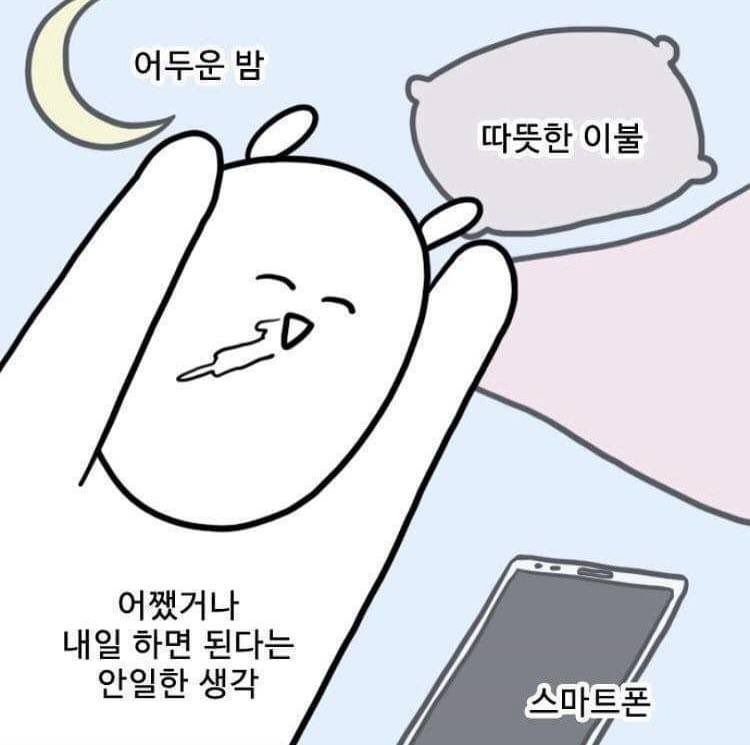

---  
title: 번아웃과 싸우기
date: 2022-08-19T00:00:00
lastUpdated: 2022-08-19T00:00:00
lang: 'ko'
description: 개발자는 번아웃과 항상 싸우면서 살아야 한다. 내가 번아웃을 어떻게 대처했는지, 지금은 어떻게 살고 있는지 회고하는 글을 써본다.  
cover: '../../../assets/images/how-to-fight-burnout-0.png'
slug: '/blog/how-to-fight-burnout'
hero:
  image:
    file: '../../../assets/images/how-to-fight-burnout-0.png'
---

## 번아웃은 개발과 친구

개발을 시작하는 사람도, 개발을 하고 있는 사람도 공부를 해야 한다. 내가 원하는 것을 개발해도, 남이 원하는 것을 개발해도, 개발을 업으로 삼고 취직하려 해도 언어, 패턴, 알고리즘부터 시작해서 프레임워크, 라이브러리 등을 모두 공부해야 한다. 공부를 하다보면 항상 마주치는 친구가 있는데, 스트레스와 피로라는 친구이다. 개발과 공부를 하다보면 천재가 아닌 이상 어느 순간 막히게 되어있고, 막히는 것을 간단하게 해결하면 좋겠지만 "왜 안되지?", "이해가 안되네"라는 말과 함께 몇 시간 몇 일을 투자하기 마련이다. 개발이나 공부가 중단되는 상황에 스트레스를 받지 않았으면 좋겠지만 적지 않은 사람들이 자신이 자신의 기대치보다 낮다고 생각하여 스트레스를 받는다.

스트레스를 잘 해소하는 방안이 있으면 좋겠지만 스트레스를 해소하는 취미나 방안이 딱히 없는 사람도 있고, 스트레스를 적절하지 못한 방법으로 해소하는 사람도 있다. 스트레스를 해소하지 못하는 사람들은 번아웃 증후군으로 연결되어 정신적으로 위험한 상황까지 가기도 한다.

이렇게 개발을 하다보면(개발이 아니더라도 자기 계발을 많이 하다보면) 스트레스를 받고, 스트레스가 번아웃으로 이어지는 상황은 적지 않은 사람들이 겪는다. 번아웃으로 이어지게 되면 다음과 같은 증상을 볼 수 있다.

> 번아웃 증후군은 의욕과 동기를 완전히 상실하고, 자존감이 저하되고, 냉소적으로 변하는 것을 말합니다. 신체 건강과 정신 건강 모두에 영향을 미쳐 일상적인 업무를 진행하기가 힘들어지면서 일과 삶이 피폐해질 수 있죠.
>  
> [출처](https://experience.dropbox.com/ko-kr/resources/burnout)

번아웃이 찾아왔다고 해서 더 강도 높은 계획을 세워서 시간을 빡빡하게 사용하여 밀린 일을 처리하려고 하면 더 악효과가 날 수 있다. 의욕과 동기를 상실했는데 밀린 일을 한꺼번에 하지 못할 가능성이 크다. 계획을 완료하지 못하면 또 스트레스를 받거나 자책을 하게 되고, 이는 더 심한 번아웃 증후군으로 이어진다.

## 그러면 어떻게 해야 할까

가장 좋은 방법은 번아웃이 찾아오기 전에 스트레스를 해소하거나 원인을 제거하는 것이다. 

_그렇다고 공부를 없애라는 건 아니구요_

이렇게 해서 번아웃이 예방하면 정말 좋겠지만 번아웃을 해결하는 방법을 찾아보는 때는 번아웃이 찾아왔거나 진행중일 때 찾아보는 경우가 많다. 번아웃이 찾아오면 의욕이 없어지고 아무것도 하기 싫어진다. 그러면 스트레스를 해소하지 못하고 번아웃과 함께 집에만 있게된다(글쓴이도 같은 상황을 겪었다). 집에만 있는 이 상황을 빠져나와 규칙적인 생활부터 만들어서 번아웃에서 빠져나와야 한다. 그런 사람들을 위해 내가 번아웃 증후군이 왔을 때 어떻게 대처했는지 돌아보면서 설명하려고 한다.

### 정신의학의 도움을 받는다

나의 상태를 가장 잘 돌아보는 방법은 의학의 도움을 받는 것이다. 정신과에 대한 편견을 없애고 마음의 병중에 하나인 번아웃이 생겼으면 정신의학의 도움을 받는 것이 가장 좋다. 병원에서는 전문의가 내가 번아웃에 빠졌는지부터 번아웃과 함께 다른 질환도 동반했는지 확실하게 확인시켜준다. 그리고 나의 상태에 맞는 처방도 내려준다. 약이나 전문의의 상담으로 도움을 받아 무기력에서 빠져나와 규칙적인 생활을 할 수 있게 만들어준다. 

### 마음챙김 명상

정신의학을 받기 힘들 수도 있고, 정신의학으로 충분하지 않을 수도 있다. 그런 사람들에게 자신을 잘 알아차릴 수 있는 마음챙김 명상을 추천한다.

> 마음챙김 명상은 ‘내가 세상과 어떻게 관계를 맺고 있는지’를 예민하게 자각하는 훈련이죠. 대부분의 사람들이 자신만의 관점으로 세상을 바라보잖아요? 노란색 안경을 끼고 있으면 노란색으로, 빨간색 안경을 끼고 있으면 빨간색으로 세상이 보이겠지요. 마음챙김 명상을 하면, 내가 어떤 색의 안경을 끼고 있었는지를 알게 돼요.
>
> [마인드풀 코리아 유정은 대표 인터뷰](https://ppss.kr/archives/242738)

명상을 깊고 좋은 자연에서 조용한 것을 느끼면서 행복을 느끼거나 정신집중하는 딱딱하고 힘든 행동이라고 생각할 수 있는데, 호흡만으로 간단하게 어디서든 할 수 있는 것이 마음챙김 명상이다. 명상은 스트레스 해소 뿐만 아니라 뇌를 쉬게해주는 효과도 가지고 있어 개발이나 공부에 탁월한 도움을 준다. 개발과 공부만 하고 사는 것은 번아웃을 더욱 가속시킬 수 있다. 그러므로 명상을 하면서 뇌를 의도적으로 쉬게하여 다른 행동을 하면서 쉬는 것보다 공부에 도움을 준다. 어렵게 생각하지 않고 명상을 시작했으면 좋겠다. 어떻게 시작하는지 모르겠는 사람들에게는 명상 가이드 어플리케이션인 [마보](https://play.google.com/store/apps/details?id=com.mabopractice.app&hl=ko&gl=US)(한국어)나 [headspace](https://play.google.com/store/apps/details?id=com.getsomeheadspace.android&hl=ko&gl=US)(영어)를 사용하거나 책으로는 차드 멩 탄의 기쁨의 접속하라를 추천한다.

개발자와 명상, 그리고 명상에 대한 구체적인 경험에 대한 더 자세한 글이 있어 [이 글](https://blog.shiren.dev/2020-03-24-%EA%B0%9C%EB%B0%9C%EC%9E%90%EC%99%80%EB%AA%85%EC%83%81/)도 보면 좋다.

### 운동하기 & 계획에 얽매이지 말기

운동의 효과는 잘 알다시피 스트레스 해소에 도움을 준다. 스트레스 해소와 함께 여러 장점을 가지고 있는 운동이지만 번아웃에 빠진 사람은 집에서 나갈 의지나 의욕조차 없어 운동을 실행하기 힘들다. 그런 사람을 위해 운동을 하는 트리거를 만들기와 계획에 얽매이지 않는 것을 추천한다. 

운동을 하는 트리거를 만들라는 것은 우리가 맨날 하는 습관에 내가 할 작은 습관을 덧붙여서 실행하라는 것이다([자세한 내용](https://www.youtube.com/watch?v=75d_29QWELk)). 예를 들어 밥을 먹고 양치를 하러 화장실에 들어가는 것은 우리가 맨날 하는 습관이다. 이때 스쿼트 한번 하기를 덧붙이면 양치를 하러갈때마다 스쿼트 한번을 할 수 있게 된다. 물론 이것도 일종의 계획이므로 나를 옭아매어 자책하여 번아웃을 더 악화시킬수도 있다. 그래서 트리거를 만들되 이것을 지키지 못하였다고 나를 자책하지 않았으면 한다.

작게 시작하는 더 자세한 방법은 제임스 클리어의 아주 작은 습관의 힘이라는 책을 추천한다.

## 마치며

우리는 개발과 공부를 지속해나아가며 번아웃에 항상 대비하고 있어야 한다. 모두가 잘 쉬고, 생활 패턴을 유지하고, 나를 점검하는 것을 빼놓지 않고 나아갔으면 한다.

글은 짧지만 번아웃에 빠진 사람들에게 도움이 되었으면 한다.