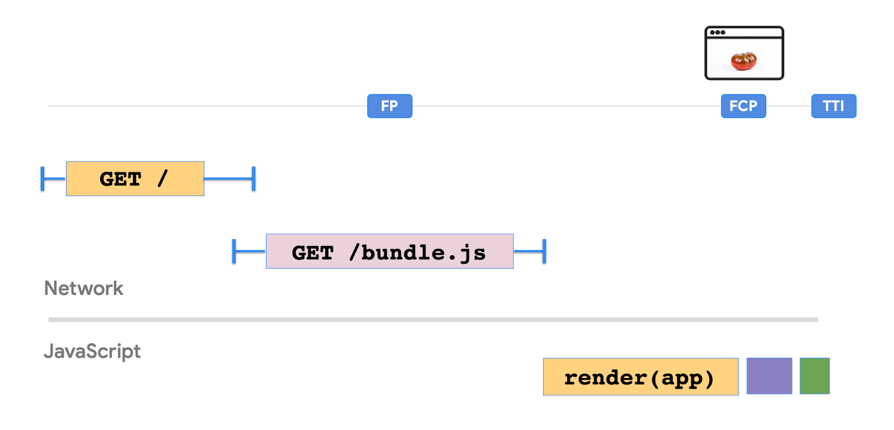
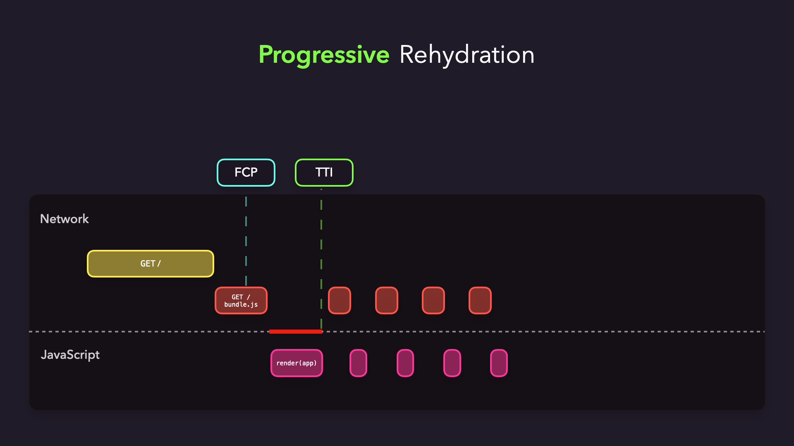
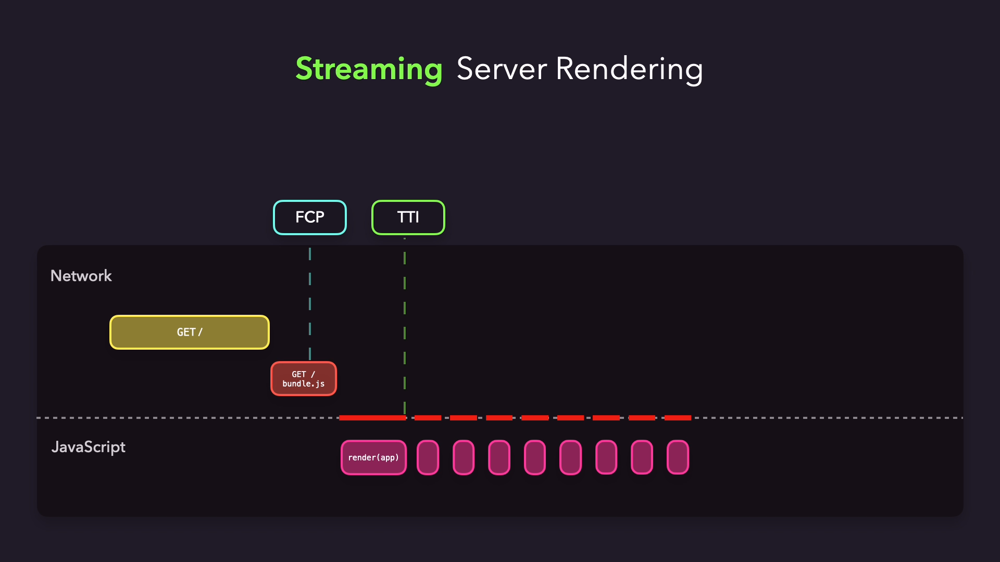

import { Aside } from '@astrojs/starlight/components';

<Aside type="note">
해당 글은 [patterns.dev](https://www.patterns.dev/react/client-side-rendering)의 간략하게 정리한 버전 + 알파입니다. 😀
</Aside>

## 여행의 시작: React의 문제점

AJAX가 등장하면서 기존의 Classic Server Side Rendering(줄여서 Classic SSR, 예를 들면 JSP, ASP같은 스크립트 언어)에서 새로운 페이지를 받아오지 않고 페이지를 자바스크립트로 작성하는 방식으로 아키텍쳐가 변경되었다. React는 모든 웹 페이지를 만들기에 유연했고, 개발 경험을 향상해줬다.

하지만 React를 모든 웹페이지에서 사용하면서 두 가지 문제가 발생하였다.

1. **첫 페이지와 상호작용할 수 있는 시간(TTI, Time to Interactive)이 길다.**
    - React로 이루어진 페이지가 컨텐츠를 렌더링하기 걸리는 시간이 매우 길다. 컨텐츠를 렌더링까지의 과정을 정리해보면 HTML 파일 받음 - JS 파일 받음 - JS 코드 중 서버에서 JSON을 받아옴 - React 렌더링 - 실제 DOM에 렌더링이 되는데, 매우 길다.
    - 요즘 웹 페이지들이 모바일을 우선적으로 고려하는 것을 생각하면 매우 느리다.
    - 이와 같은 이유로 기타 데이터를 불러오는 시간까지 도달하기에 매우 긴 시간이 걸린다.

2. **크롤러가 내용을 저장하지 못한다.**
    - 검색 엔진의 크롤러가 내용을 저장소에 저장할 정도(내용을 긁어올 수 있을 만큼)로 빠르게 렌더링 되지 않아서 CSR로 이루어진 웹 어플리케이션을 분석하는데 제한사항이 생긴다.
    - 크롤러가 내용을 저장하고 head에 있는 태그를 분석해서 색인을 생성하는 과정을 거쳐야 하는데 React의 경우에는 "JS 받아옴 - React 렌더링 - React-helmet을 통해 head 생성"을 거쳐야 하는데 크롤러가 이를 head를 생성할 때까지 기다리지 않을 가능성이 크다.

## hydration의 등장 (SSR)

검색엔진, 즉 [SEO(검색 엔진 최적화)](https://developer.mozilla.org/ko/docs/Glossary/SEO)를 위해 Server Side Rendering 개념을 다시 이용하기로 했다. 서버에서 요청이 오면 서버에서 렌더링 한 후 HTML을 미리 생성해 보낸다. 그 이후 JS를 받아 실행한다. 이 때 JS의 역할은 웹 앱을 렌더링하는 것이 아니라 기존 HTML이 제대로 렌더링되었는지 확인하고, 이벤트 핸들러를 붙여주는 역할이다. 앞의 HTML이 제대로 렌더링되었는지 확인하고, 이벤트 핸들러를 붙여주는 과정을 hydration이라고 한다.

SSR과 다른 서버에서 하는 기능(Image Optimization, i18n...)을 해주는 Next.js를 기본으로 쓸 정도로 웹 어플리케이션 트렌드는 SSR이 기본인 상황이 되었다고 봐도 과언이 아니다(Next.js를 중심으로 생태계가 구축되고 있으니..).

### 근데.. 속도는 괜찮은가요?

하지만 여전히 **첫 페이지와 상호작용할 수 있는 시간(TTI, Time to Interactive)이 길다**는 문제는 "두번째 렌더링은 실제 DOM 렌더링에 쓰이지 않기 때문에 시간을 단축하는데 도움을 준다"라는 이유로 해결되지 않았다. SSR이라는 해결책만 사용하기에는 여러가지 단점이 있기에 개발자들은 여러 해결책을 찾아 나섰다.

## Static Rendering(SSG)

SSR은 모든 요청에 렌더링을 시작하고, HTML 파일을 만들어 응답한다. 이 때 Static Rendering은 "모든 요청에 렌더링을 시작한다"에 중점으로 해결하려고 한다. Static Rendering은 요청이 올 때마다 HTML을 만드는 것이 아닌, 사이트를 구축할 때 HTML을 만들어 놓고 요청이 올 때 렌더링을 하지 않고 만들어둔 HTML을 제공하는 방식이다. 정적 파일을 캐시 할 수 있고, CDN과 동작하면 높은 성능을 자랑한다.

SSG는 Next.js, Gatsby, Vuepress, Nuxt.js, Gridsome 등에서 활용할 수 있다.

하지만 이 방식은 고려해야 할 사항이 몇 가지 존재한다.

1. 데이터가 변경되면 재배포를 해야한다.
2. CDN 플랫폼이 빨라야 한다.
3. 동적 컨텐츠가 많으면 많을수록 쓰기 어렵다.
4. 결국 hydration을 기반으로 하기 때문에 hydration의 단점을 가지고 간다.

### Increamental Static Regeneration(ISR)

ISR 패턴은 SSG패턴에서 동적 데이터를 잘 활용하기 위해서 만든 패턴이다. ISR 패턴을 사용하면 전체 사이트를 재배포할 필요 없이 페이지별로 정적 재생성을 다시 할 수 있다.

ISR은 [stale-while-revalidate패턴](https://web.dev/stale-while-revalidate/)을 활용하여 정적 재생성을 돕는다. 요청 이후 일정 시간동안은 요청 때 만들었던 정적 사이트를 캐시해놓고 캐시된 사이트를 응답한다. 일정 시간 이후에는 서버에서 해당 페이지의 유효성을 확인하고 정적 사이트를 재생성한다.

SSG의 단점을 보완하여 속도는 SSG의 장점인 빠른 속도(서버 렌더링 X)와 동적 데이터를 재배포 없이 사용할 수 있다는 점을 모두 갖출 수 있다.

이러한 ISR패턴은 Next.js 9.5버전부터 사용할 수 있다.

## Progressive hydration

SSR은 상호작용할 수 없는 HTML을 만들어 주고 JS를 전달해 hydration을 전체 어플리케이션에 한다. Progressive hydration은 전체 어플리케이션에 hydration을 하는 것을 오버헤드라고 생각하고 필요하지 않은 부분은 나중에 hydration하는 방식으로 SSR의 느린 속도를 해결하고자 한다.

Progressive hydration의 기본은 어플리케이션을 청크로 나누어 성능을 향상하는 것이다. 그래서 전체 UX에 어떤 영향을 미칠지 고려해야 한다. patterns.dev에서는 Progressive hydration을 하려면 아래 사항을 충족해야 한다고 말한다.

1. 모든 컴포넌트에 SSR을 사용할 수 있다.
2. 개별 컴포넌트 또는 청크로 코드 분할을 지원한다.
3. 개발자가 정의한 순서에 따라 청크의 클라이언트 측 hydration하는 것을 지원한다.
4. 이미 hydration된 청크에 대한 사용자 입력을 차단하지 않는다.
5. 지연된 hydration를 가진 청크에 대해 일종의 로딩 표시기를 사용할 수 있다.

React의 [동시 모드](https://reactjs.org/blog/2022/03/29/react-v18.html#gradually-adopting-concurrent-features)는 위를 충족하며 Progressive hydration을 구현할 수 있다.

> 페이지에 있는 각 청크의 수화는 React 동시 모드의 작업이 됩니다. 사용자 입력과 같이 우선 순위가 더 높은 작업을 수행해야 하는 경우 React는 수화 작업을 일시 중지하고 사용자 입력을 수락하도록 전환합니다. [lazy(), Suspense](https://reactjs.org/docs/code-splitting.html#reactlazy)와 같은 기능 을 사용하면 선언적 로드 상태를 사용할 수 있습니다. 청크가 지연 로드되는 동안 로드 표시기를 표시하는 데 사용할 수 있습니다. 
> 
> +SuspenseList로 우선순위를 정할 수도 있지만 아직 알파버전에서 나오지 않았습니다.

Progressive hydration은 코드를 분할할 수 있어 번들 크기 감소에 도움을 주지만 어플리케이션 로드 시 모두 대화형으로 만들어야 하는 어플리케이션에는 적합하지 않다(ex. 소셜 미디어 어플리케이션).

자세한 설명과 시연은 [Google I/O '19](https://www.youtube.com/watch?v=k-A2VfuUROg&t=960s)에서 볼 수 있다.

## Streaming SSR

Streaming SSR은 HTML을 청크 단위로 보내 브라우저가 점진적으로 렌더링할 수 있도록 하는 것이다. HTML 청크를 클라이언트에 스트리밍하여 HTML의 바이트를 더 빨리 수신할 수 있게 하는 것이다. 

스트리밍을 통해 빨리 수신하게 되면 응답에 대해 일찍 구문 분석하고 렌더링하게 된다. 서버 사이드 렌더링을 하므로 SEO 지원도 된다는 장점이 있다. 하지만 역시 단점도 있다. styled-components같은 CSS-in-JS 프레임워크들은 렌더링하는 동안 style 태그에 요소를 추가하기 때문에 Streaming SSR을 구현하는데 [추가 작업](https://medium.com/styled-components/v3-1-0-such-perf-wow-many-streams-c45c434dbd03#:~:text=Streaming%20server%2Dside%20rendering%20was,handle%20back%2Dpressure%20more%20easily.)을 해주어야 한다.

## [React Server Components](https://reactjs.org/blog/2020/12/21/data-fetching-with-react-server-components.html)

React 서버 컴포넌트는 SSR을 대체하는 것이 아니라 SSR과 같이 쓰는 방식으로 구성된다. React 서버 컴포넌트에서 쓴 패키지나 코드는 클라이언트로 전송되지 않기에 클라이언트로 보내는 번들 사이즈가 줄어든다. 그리고 컴포넌트 트리 어디에서나 백엔드에 엑세스할 수 있게 해준다(Next.js에서는 최상단에서만 백엔드와 액세스할 수 있다).

자세한 설명과 추가 자료는 [여기](https://www.patterns.dev/posts/react-server-components/)에서 볼 수 있다.

## Selective hydration

Selective hydration은 Streaming SSR과 Progressive hydration에서 작성한 React 동시 모드를 활용해서 만든 방법이다.

기존의 SSR방식은 어플리케이션을 모두 렌더링하고 HTML 파일을 보냈지만 Selective hydration에서는 SSR에 필요한 데이터를 받아와야 할 때 fallback을 먼저 추가해 놓고 Streaming으로 우선 클라이언트에 보내고 hydration을 한다. 그 이후 fallback에 들어갈 컴포넌트가 로딩이 완료되면 fallback 자리에 해당 컴포넌트를 넣고 hydration을 진행한다.

## Islands Architecture

Island Architecture는 섬이라는 개념을 도입한다. 먼저 렌더링하거나 수화할 필요가 없는 정적 HTML을 놓는다. 그리고 상호작용 하는 부분(이를 섬이라고 한다.)만 수화하도록 한다. 그리고 섬은 모두 독립적으로 작동하여 마이크로 프론트엔드와 유사하게 작동한다.

[Astro](https://astro.build/)와 [Marko](https://markojs.com/)가 Island Architecture를 지원한다.

## Resumablity

Resumablity는 hydration으로 클라이언트에서 상태를 복구하는 것이 오버헤드라고 보는 개발자에 의해 만들어졌다. 서버가 수행한 렌더링을 다시 수행하지 않으면서 어플리케이션의 상태를 유지하기 위해 HTML에 상태와 컴포넌트를 직렬화하여 삽입한다.

현재 [Qwik](https://github.com/builderio/qwik)이라는 프레임워크가 이를 지원하며 아직 minor 버전도 올라오지 않았다(아직 이론을 간단하게 구현해 놓은 수준인 것 같다).

## 여행을 마치며

여행을 마치면서 생각나는 것은 여행의 중후반에는 이해하기 어려운 아키텍처가 많아지면서 설명하는 것이 짧아지고 간단하게 안내하는 방식이 되었지만 React 18의 등장, 그리고 React가 기본 스택이 된 지금 다른 프레임워크가 왜 나오는지에 대해 알아보는 기회가 된 것 같다.

### 출처

- [모든 이미지 출처](https://www.patterns.dev/)
- [Islands Architecture](https://jasonformat.com/islands-architecture/)
- [React new SSR architecture](https://github.com/reactwg/react-18/discussions/37)