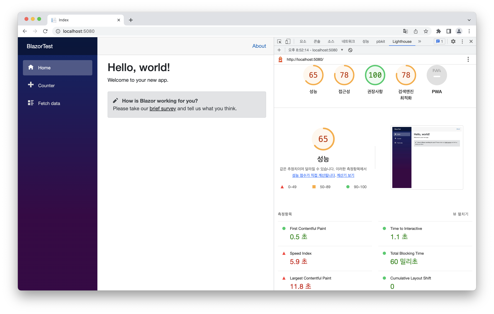

import { Aside } from '@astrojs/starlight/components';
import PackageVersion from '@components/PackageVersion.astro';

<Aside type="caution">
  이 글은 2022년에 작성되었습니다. 아래 버전 기준으로 작성되었으며, 현재 상황과 맞지 않을 수 있습니다.
  <PackageVersion versions={[['dotnet', '6']]} />
</Aside>

## Just For Fun...

우리나라에서 C#이 메인이 되지도 않았고, [WASM이 매우 많은 성능 향상을 이끌어내는가](https://zaplib.com/docs/blog_post_mortem.html)의 이야기는 아직도 현재진행중이다. 하지만 이번에는 Blazor의 성능과 사용법, 그리고 장단점에 알아보고 재미로 사용해보려고 Blazor로 웹사이트를 만들어보기로 결정했다.

Blazor의 시작 방법은 매우 쉽다. [dotnet](https://dotnet.microsoft.com/en-us/download)을 설치하고 `dotnet new blazorwasm -o 프로젝트이름 --no-https -f net6.0`으로 실행하면 프로젝트 이름으로 Blazor WASM 프로젝트가 만들어진다.

Blazor의 [튜토리얼](https://learn.microsoft.com/ko-kr/aspnet/core/blazor)은 매우 잘되어있다. 그래서 따라가다보면 쉽게 Blazor를 마스터할 수 있다. 그래서 이번 포스팅에서는 Blazor의 특징을 다루려고 한다.

### dotnet 런타임을 다운받는다.

때문에 [LCP](https://web.dev/lcp/)까지 시간이 오래걸린다. 현재 Hydration을 개선하는 방식으로 JS 생태계가 발전해나아가고 있는데 런타임 WASM을 다운받는 것은 큰 단점이 될 수 있다. 물론 큰 JS를 삽입하지만 않는다면 속도는 양호하다.



하지만 TypeScript같은 컴파일타임에 타입을 검사하는 것 뿐만아니라 런타임에도 타입을 검사하기 때문에 타입 검사가 더 강력하다. C#의 문법을 아는 사람이라면 더욱 빠르게 적응할 수 있다.

### 라우팅과 상태관리

양방향 바인딩을 바탕으로 컴포넌트간 통신/컴포넌트와 DOM과 통신을 다룬다. 양방향 바인딩이 데이터를 주고 이벤트가 트리거되었을 경우 바인딩된 데이터를 바꿔주는 방식으로 바인딩한다. 기본 input에서는 `@bind="데이터`방식으로 바인딩하고 바인딩된 데이터를 바꾸는 방법은 `@bind:event="이벤트이름"`으로 바꾼다. 컴포넌트에서는 `@bind-이름="데이터"`방식으로 바인딩하고 이벤트는 `이름Changed`로 생성된다. 이벤트에 함수를 바인딩 하는 방식은 `@on이벤트="함수이름"`이다.

전역 상태를 관리하려면 외부 라이브러리를 사용해야 한다.

라우팅은 파일 기반 라우팅을 사용하고 있으며 `@page`지시문이 있는 파일만 라우팅에 포함한다. 동적 라우팅 또한 지원하며 동적 라우팅의 제약조건을 설정하는 것또한 가능하다. Routing이 변했을 경우 생명주기인 `LocationChanged`도 제공한다.

## 실제 프로젝트에서는

위의 특징 말고도 실제 프로젝트에서 만나볼 수 있는 특징들을 살펴보려고 한다.[]() 기반으로 만들어진 [](https://github.com/SimYunSup/PUSH_SERVER_WEB)

### 리스트 렌더링 및 조건부 렌더링

리스트 렌더링과 조건부 렌더링은 C#의 구문을 따른다. `@if(조건문)`를 통해 조건문에 맞는 중괄호 내의 HTML 태그들을 렌더링한다. 그리고 `@foreach(var 요소 in Iterable<요소타입>)`으로 중괄호 내의 HTML태그 렌더링을 반복한다.

```cs
<ul>
    @if (isShowingNumber == true)
    {
        @foreach (var ProjectNumber in new number[]{ 1,2,3,4,5 }) {
            <li class="num">
                @ProjectNumber
            </li>
        }
    }
</ul>
```

### HttpClient 래핑

여타 다른 JS 프레임워크에서도 그렇듯이 API Call을 담당하는 HttpClient를 래핑하여 사용한다. 밑은 access token - refresh token을 사용하는 프로그램에서 간단하게 래핑한 HttpClient를 보여준다.

```cs
using PUSH_SERVER_WEB.Models;
using Microsoft.AspNetCore.Components;
using System.Net;
using System.Net.Http.Headers;
using System.Net.Http.Json;
using System.Text;
using System.Text.Json;
using Microsoft.JSInterop;

namespace PUSH_SERVER_WEB.Services
{
    public interface IHttpService
    {
        Task<T?> Get<T>(string uri);
        Task<T?> Post<T>(string uri, object value);
        Task<T?> Delete<T>(string uri);
        Task<T?> Put<T>(string uri, object value);
        Task<T?> Patch<T>(string uri, object value);
    }

    public class HttpService : IHttpService
    {
        // ...구현부 생략

        private async Task<T?> sendRequest<T>(HttpRequestMessage request, string uri)
        {
            // add jwt auth header if user is logged in and request is to the api url
            var token = await _localStorageService.GetItem<string>("accessToken");
            var isApiUrl = !request.RequestUri?.IsAbsoluteUri ?? false;
            if (token != null && isApiUrl)
                request.Headers.Authorization = new AuthenticationHeaderValue("Bearer", token);
            
            var response = await _httpClient.SendAsync(request);

            // auto logout on 401 response
            if (response.StatusCode == HttpStatusCode.Unauthorized)
            {
                if (uri != "/api/user/refresh")
                {
                    try
                    {
                        var RefreshToken = await _localStorageService.GetItem<string>("refreshToken");

                        var Response = await Post<User>("/api/user/refresh", new { refresh_token= RefreshToken });

                        await _localStorageService.SetItem("refreshToken", Response?.refresh_token);
                        await _localStorageService.SetItem("accessToken", Response?.access_token);
                        response = await _httpClient.SendAsync(request);
                    }
                    catch
                    {
                        await _localStorageService.RemoveItem("refreshToken");
                        await _localStorageService.RemoveItem("accessToken");
                        _navigationManager.NavigateTo("/login");
                        return default;
                    }
                }
                else
                {
                    await _localStorageService.RemoveItem("refreshToken");
                    await _localStorageService.RemoveItem("accessToken");
                    _navigationManager.NavigateTo("/login");
                    return default;
                }
            }

            // throw exception on error response
            if (!response.IsSuccessStatusCode)
            {
                var error = await response.Content.ReadFromJsonAsync<Dictionary<string, string>>();
                if (error != null)
                {
                    throw new Exception(error["error_message"]);
                }
                else
                {
                    throw new Exception();
                }
            }
            var sb = new StringBuilder();
            var body = await response.Content.ReadAsStringAsync();
            if (!string.IsNullOrWhiteSpace(body))
                sb.AppendLine(body);
            if (sb.ToString() != "")
            {
                return await response.Content.ReadFromJsonAsync<T>();
            }
            else
            {
                return default;
            }
        }
    }
}
```

## 이외에도...

프론트엔드에 존재하는 MSW같이 backend API를 mocking하여 backend API가 만들어지기 전까지 HttpClient를 mocking하는 것 또한 존재한다. 자세한 것은 [다음 구현](https://jasonwatmore.com/post/2020/08/13/blazor-webassembly-jwt-authentication-example-tutorial#fake-backend-handler-cs)을 참고하자.

EditForm 컴포넌트로 form 데이터의 유효성을 검사할 수 있다. Model을 지정할 수 있는데 이때 `Required`, `StringLength()`, `Range`등 여러가지의 특성을 활용해 유효성 검사를 쉽게 할 수 있다.

개발하다보면 JS를 호출해야 할 상황이 올 수 있다. 이때 TypeScript를 사용하여 Type 검사를 진행할 수도 있다.

이것은 [다음 컨퍼런스 발표](https://forum.dotnetdev.kr/t/blazor-webassembly-webpack-sass-typescript-net-conf-2022-x-seoul-replay/3087)를 바탕으로 세팅을 하면 된다. 하지만 이 컨퍼런스와 다른 부분은 `index.js`를 직접 import 하지말고 JSRuntime에서 [JS 파일를 호출하는 방식](https://learn.microsoft.com/ko-kr/aspnet/core/blazor/javascript-interoperability/call-javascript-from-dotnet?view=aspnetcore-6.0#javascript-isolation-in-javascript-modules)을 사용하는 것이 전역 네임스페이스를 오염시키지 않는다는 점에서 좋다.

이를 위해서 webpack 설정에 다음 구문을 추가해야 한다.

```js
module.exports = {
  // ...
  output: {
    path: path.resolve(__dirname, "wwwroot/build"),
    filename: "index.js",
    libraryTarget: 'umd',
    library: '라이브러리 이름',
  },
  // ...
}
```

그리고 C#에서는 다음과 같이 호출해야 한다.
```cs
  @code {
    private IJSObjectReference? module;

    protected override async Task OnAfterRenderAsync(bool firstRender)
    {
        if (firstRender)
        {
            module = await JS.InvokeAsync<IJSObjectReference>("import", 
                "./index.js");
        }
    }

    public async ValueTask<string?> Prompt(string message) =>
        module is not null ? 
            await module.InvokeAsync<string>("showPrompt", message) : null;
}
```