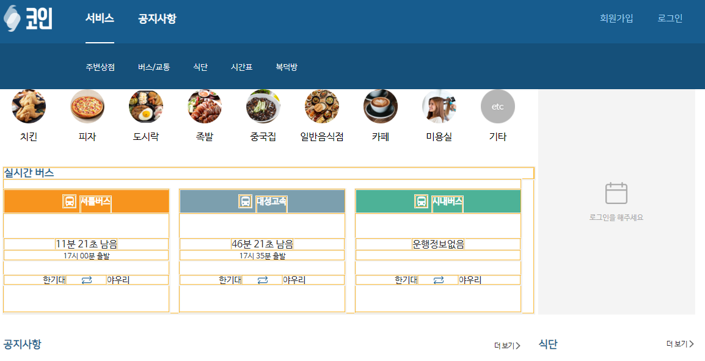
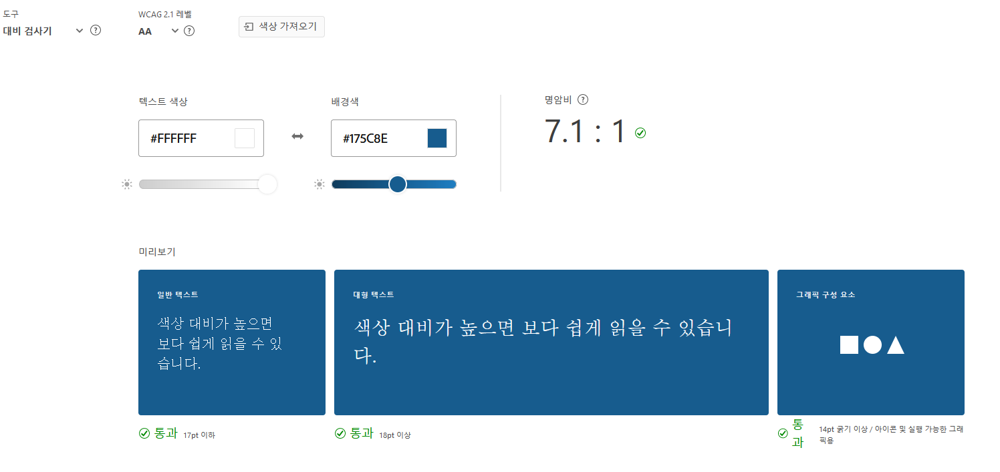
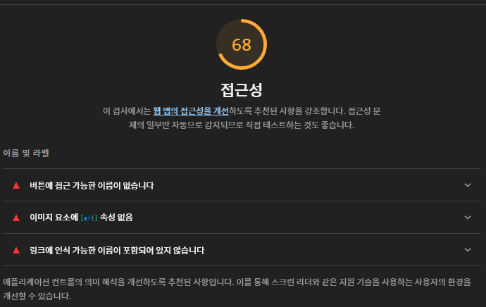

---  
title: 웹 접근성을 한 번 생각해보기
lastUpdated: 2022-10-03T00:00:00  
description: 우리는 보통 장애인의 반대되는 사람들을 상대로 서비스를 만든다. 그렇다면 장애인들을 위해서는 서비스의 어떤 것을 고려해야할까?
cover: '../images/think-with-a11y-0.png'
slug: '/docs/think-with-a11y'
---

프론트엔드 개발자들은 개발을 배워가면서 웹 접근성과 의미론적인 웹에 대해 들어본 적이 있을 것이다(없다면 이 포스트에서 약하게나마 알아보자).

웹 접근성은 모든 사용자들이 서비스를 이용할 수 있도록 웹 사이트 또는 웹앱을 만드는 것이다. 장애인들도, 일시적으로 장애를 가진 사람에게도 같은 서비스를 제공하도록 설계해야 된다고 볼 수 있겠다. 하지만 어떤 장애인들을 위해 어떻게 서비스를 만들어야 하는지 모르는 사람들과 "장애인들이 우리의 서비스를 쓸까?"라는 의문이 들 정도의 서비스가 작은 경우의 개발자들은 "굳이 웹 접근성을 고려해야 할 까?"라는 의문이 들 수도 있다. 하지만 세계보건기구는 세계 인구의 15%가 스스로 장애를 갖고 있다고 추정하고 있으며, 장애를 가진다는 것이 우리가 생각하는 것보다 흔한 일이다(ex. 색맹, 시력 저하, 일시적인 신체의 기관 마비...). 그래서 우리는 장애인들(어쩌면 장애를 가진 고객일 수도 있죠!)을 위해서 웹 접근성을 고려해야 하고, 우리나라에는 아직 없지만 다른 나라에서 웹 접근성을 고려하지 않는 경우 위법이 될 수도 있기에 타 국가에 서비스가 진출하는 경우 웹 접근성을 고려하지 않았다면 지금이라도 고려해야 할 것이다.

## 웹 접근성을 한 번 생각해보자.



위의 사진은 현재(2022.10.03) 동작하고 있는 커뮤니티 서비스의 [헤더](https://github.com/BCSDLab/KOIN_WEB/blob/develop/src/components/Topnav.js)이다. 이런 헤더를 만들 때 고려해야 할 요소는 무엇일까?

### `outline: none;`을 피하라

```css
* {
    outline: none;
}
```

디자이너의 요청으로, 혹은 이쁘지 않아서 focus되었을 때 `outline`이 나오는 것을 없앨 수도 있다. 하지만 이는 키보드 접근성을 낮출 뿐만 아니라, 많은 사용자들이 불편을 겪게 하는 UX의 시발점이 될 수 있다. 이쁘지 않아서 `outline`을 한 경우에는 focus되었을 때 `outline`을 대체하여 focus되었다는 것을 알려주는 css가 필요하다. 아니라면 마우스를 이용하는 사용자에게만 치중되어 있어 웹 접근성을 떨어트리는 요인이 될 수 있다.

focus되었을 때(현재는 mouseEnter시에만 된다) 서비스 버튼 하단에 `border`가 생기는데 `outline`을 없앨 경우 이를 하위 메뉴에도 사용하는 것도 방법 중에 하나이다.

### 모든 요소에 키보드로 접근할 수 있어야 한다.

가장 중요하고 어려운 웹 접근성 고려사항 중 하나이다. 헤더를 만들게 될 경우 여러가지 방법으로 헤더를 만들게 될텐데 이 경우 모든 링크/버튼에 키보드로 접근이 가능해야 한다. 즉, 키보드 접근을 위해서 추가 로직이 필요할 수 있다는 말이다. 위의 헤더에서는 "서비스"나 "공지사항" focus되었을 때 밑의 하위 메뉴가 펼쳐지는데 그것에 접근 가능해야 한다는 이야기이다.

### 텍스트와 배경의 색상의 대비가 명확해야 한다.



색상 대비가 높지 않아 읽을 수가 없거나 무슨 요소인지 모를 경우도 있다. 이를 위해서 [Adobe Color](https://color.adobe.com/ko/create/color-contrast-analyzer)라는 색상대비 검사/색맹 안전 검사를 해주는 검사기가 있으므로 사용하여 색상 대비가 높은지, 색맹에 대해 안전한지 확인하면 좋다.

### 애니메이션 비선호? 다크 모드?

윈도우에는 `Windows에서 애니메이션 표시`, Mac에서는 `Reduce motion`이라는 설정이 있다. 이 설정은 PC에서 사용되는 애니메이션을 없애준다. 하지만 웹 페이지에서는 따로 애니메이션을 비활성화 하는 것을 설정해주어야 한다. CSS에는 `@prefers-reduced-motion`이라는 media query 속성이 존재한다. 이 속성을 통해 애니메이션을 줄여달라는 설정을 껐는지 확인할 수 있다.

이외에도 다크모드 구현할 때 한 번이라도 봤을만한 `@prefers-color-scheme`이라는 속성이 있다. 이 색상 구성을 고려하는 것 또한 웹 접근성을 높이는 한가지 방법이다. 즉 웹 접근성을 높이는 것은 어떻게 보면 사용자의 UX를 향상시키는 방법 중 하나가 될 수 있다.

## 웹 접근성에 필요한 요소들을 모두 기억하고 개발에 적용할 수는 없다.

하지만 이런 웹 접근성에 필요한 요소들을 모두 기억하면서 개발에 적용할 수 없다. 이를 위해서 테스트가 있다.



가장 유명한 것으로는 lighthouse test가 있다. lighthouse의 테스트는 간단한 접근성만 감지하므로 깊은 테스트는 직접 하는 것이 좋다.

Lighthouse는 수동 테스트외에 [CI도 제공하므로](https://github.com/GoogleChrome/lighthouse-ci) 쉽게 PR마다 Lighthouse 결과를 만들 수 있다.

이외에도 수동 테스트를 진행할 수 있는 도구로 HTML CodeSniffer, aXe, Accessibility Insights, WAVE 등이 있다.

코드 상에서 오류를 탐지할 수 있는 [eslint/jsx-a11y](https://github.com/jsx-eslint/eslint-plugin-jsx-a11y) 또한 존재하니 적용하는 편이 좋다.